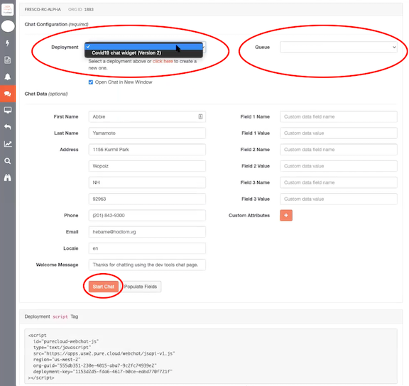

This Genesys Cloud Developer Blueprint explains how to deploy the Lex-Kendra chatbot on Genesys Cloud. The Lex-Kendra chatbot solution, which is part of the AWS Contact Center Intelligence (CCI) accelerator, combines this basic Lex chatbot with Amazon Kendra to create a Lex-Kendra self-service chatbot. This combination enables an Amazon Lex flow to invoke an AWS Lambda function to call Amazon Kendra after a customer initiates a chat and enters a triggering question.

This integrated solution enhances the capabilities of Genesys Cloud with conversational AI capability from AWS. Both Genesys Cloud and the Lex-Kendra solution components reside natively on AWS. Genesys Cloud uses the Genesys Cloud Amazon Lex integration to provide customers with a standard Amazon Lex chatbot. Amazon Kendra uses natural language processing and machine learning abilities to process the customer's question and search an informational database stored in Amazon S3. Amazon Kendra and AWS Lambda then route the discovered answer back into the customer chat. This all occurs without live agent assistance.

* [Solution components](#solution-components "Goes to the Solution components section")
* [Prerequisites](#prerequisites "Goes to the Prerequisites section")
* [Implementation steps](#implementation-steps "Goes to the Implementation steps section")
* [Additional resources](#additional-resources "Goes to the Additional resources section")

## Solution components

* **Genesys Cloud** - A suite of Genesys cloud services for enterprise-grade communications, collaboration, and contact center management. Genesys Cloud is the platform where you can access the Lex-Kendra chatbot solution.
* **Genesys AppFoundry** - The Genesys app marketplace for solutions that run on the Genesys Cloud platform. You download the integration used in this solution from the Genesys AppFoundry.
* **AWS** - Amazon Web Services, a cloud computing platform that provides a variety of cloud services such as computing power, database storage, and content delivery. AWS hosts Genesys Cloud.
* **AWS CCI** - Contact Center Intelligence that enables the integration of AI into contact centers. The Lex-Kendra chatbot is part of the AWS CCI self-service accelerator.
* **Amazon Lex** - A service in AWS that uses machine learning to build conversational interfaces (chatbots). You can call the Amazon Lex chatbot from inbound chat flows with Architect, the Genesys Cloud flow designer.
* **Amazon Kendra** - An intelligent search service in AWS that is powered by machine learning. The Lex-Kendra chatbot uses Amazon Kendra to search for answers to the customer's questions.
* **Amazon S3** - Simple Storage Service, an object storage service in AWS. Amazon S3 hosts the document repository searched by Amazon Kendra.
* **AWS CloudFormation** - A management tool that uses templates to write, deploy, and maintain your AWS infrastructure. An AWS CloudFormation template for the Lex-Kendra chatbot is used to deploy the AWS components of the solution.
* **AWS IAM** - Identity and Access Management that controls access to AWS resources such as services or features. Use AWS IAM to set permissions to allow and deny access to AWS resources for the Lex-Kendra chatbot solution.
* **AWS Lambda** - Serverless computing service for running code without creating or maintaining the underlying infrastructure. AWS Lambda executes Amazon Kendra fulfillment and other operations for the solution.   

## Prerequisites

### Specialized knowledge

* Administrator-level knowledge of Genesys Cloud
* AWS Cloud Practitioner-level knowledge of AWS CloudFormation, AWS IAM, Amazon Lex, Amazon S3, and AWS Lambda
* Conceptual-level knowledge of Amazon Kendra

### Genesys Cloud account

* A Genesys Cloud license. For more information, see [Genesys Cloud Pricing](https://www.genesys.com/pricing "Opens the Genesys Cloud pricing page").
* A Genesys Cloud subscription that allows premium applications. For more information, see [What are premium applications?](https://help.mypurecloud.com/?p=173966 "Opens the What are premium applications? article").
* (Recommended) The role of Master Admin. For more information, see the [Roles and permissions overview](https://help.mypurecloud.com/?p=24360 "Opens the Roles and permissions overview article").

### AWS account

* Administrator-level credentials enabling you to create and edit AWS CloudFormation templates, AWS IAM permissions, an Amazon S3, an AWS Lambda function, Amazon Kendra indexes, and an Amazon Lex chatbot.
* An AWS region that supports an Amazon Lex endpoint. Amazon provides this information in [Amazon Lex endpoints and quotas](https://docs.aws.amazon.com/general/latest/gr/lex.html "Opens the Amazon Lex endpoints and quotas page").

## Implementation steps

* [Create an Amazon S3 bucket and upload the FAQ document](#create-an-amazon-s3-bucket-and-upload-the-faq-document "Goes to the Create an Amazon S3 bucket and upload the FAQ document section")
* [Deploy the AWS CloudFormation template](#deploy-the-aws-cloudformation-template "Goes to the Deploy the AWS CloudFormation template section")
* [Create a queue in Genesys Cloud](#create-a-queue-in-genesys-cloud "Goes to the Create a queue in Genesys Cloud section")
* [Install and activate the Amazon Lex integration app on Genesys Cloud](#install-and-activate-the-amazon-lex-integration-app-on-genesys-cloud "Goes to the Install and activate the Lex integration app on Genesys Cloud section")
* [Use Architect to call the Lex Kendra chatbot](#use-architect-to-call-the-lex-kendra-chatbot "Goes to the Use Architect to call the Lex-Kendra chatbot section")
* [Create a Genesys web chat widget and test the solution](#create-a-genesys-web-chat-widget-and-test-the-solution "Goes to the Create a Genesys web chat widget and test the solution section")
* [Deploy the Lex Kendra chatbot to your website](#deploy-the-lex-kendra-chatbot-to-your-website "Goes to the Deploy the Lex-Kendra chatbot to your website section")

### Create an Amazon S3 bucket and upload the FAQ document

1. Create an Amazon S3 bucket to serve as the document repository and copy the bucket name for later use. For more information, see [Step 1: Create your first S3 bucket](https://docs.aws.amazon.com/AmazonS3/latest/gsg/CreatingABucket.html "Opens the Step 1: Create your first S3 bucket page") in the AWS documentation.
2. Download an FAQ file in .csv format from the [aws-lex-kendra](https://github.com/GenesysCloudBlueprints/aws-lex-kendra "Opens the aws-lex-kendra repository") GitHub repository.

  :::primary
  **Note**: Genesys supplies a sample FAQ file (WHO_COVID_FAQ.csv) for your use. The source for this information is the World Health Organization Q&A on [Coronavirus disease (COVID-19)](https://www.who.int/emergencies/diseases/novel-coronavirus-2019/question-and-answers-hub/q-a-detail/q-a-coronaviruses "Opens the Coronavirus disease COVID-19 FAQ article"). Check the WHO page for the latest and most complete COVID-19 information.
  :::

3. Upload the FAQ file, or the .csv file of your choice, to your Amazon S3 bucket. If you use your own file, use the FAQ file from the aws-lex-kendra repository as a model.     

### Deploy the AWS CloudFormation template

Genesys has prepared an AWS CloudFormation template that creates an AWS stack for the Lex-Kendra chatbot. The stack completes the following operations:
* Creates an IAM role for Genesys Cloud in your AWS account.
* Creates the Amazon Lex chatbot.
* Creates the Amazon Kendra FAQ index.
* Creates a search intent to integrate Amazon Lex and Amazon Kendra.

To deploy the prepared AWS CloudFormation template, complete the following steps:
1. Log in to the AWS console.
2. Click [CloudFormation service](https://console.aws.amazon.com/cloudformation/home?region=us-east-1#/stacks/create/template?stackName=lex-kendra&templateURL=https://aws-quickstart.s3.amazonaws.com/quickstart-quantiphi-lex-kendra-backend/templates/lex_bot_kendra_master.template.yaml "Opens the CloudFormation template"). This link includes configuration details that pre-populate the AWS CloudFormation template with required values.
3. Confirm the default selections of **Template is ready** and **Amazon S3 URL**.
4. Confirm that the URL for the **lex_bot_kendra_master.template.yaml** file is entered in the Amazon S3 URL field.
5. Click **Next**.
6. Copy the name of the Amazon S3 bucket you created in the previous implementation section and paste it in the **Amazon S3 bucket with documents** field in the CloudFormation template.
7. Enter **76562898547** in the Assuming Account ID field. This is the Genesys Cloud production account ID.
8. Enter your Genesys Cloud organization ID in the Organization's ID field. To obtain your ID, see [FAQ: How do I find my organization ID?](https://help.mypurecloud.com/?p=78571 "Opens the FAQ: How do I find my organization ID? article") in the Genesys Cloud Resource Center.   
9. Click **Next**.
10. On the Configure stack options window, click **Next**.
11. On the Review Lex-Kendra window, click the acknowledgements at the bottom of the page and then click **Create stack**.

  :::primary
  **Note**: The stack creation process can take up to 30 minutes. During this time, you can complete the [Create a queue in Genesys Cloud](#create-a-queue-in-genesys-cloud "Goes to the Create a queue in Genesys Cloud section") and [Install and activate the Lex integration app on Genesys Cloud](#install-and-activate-the-amazon-lex-integration-app-on-genesys-cloud "Goes to the Install and activate the Lex integration app on Genesys Cloud section") procedures, which are described in the following sections.
  :::

12. After stack creation is complete, open the Amazon Lex console and confirm that the Lex-Kendra stack exists  under **CloudFormation** > **Stacks**.
13. In the Amazon Lex console under **CloudFormation > Stacks**, click the **Resources** tab.
14. Copy the **AssumeIAMRrole** Physical ID for use in the [Install and activate the Lex integration app on Genesys Cloud](#install-and-activate-the-amazon-lex-integration-app-on-genesys-cloud "Goes to the Install and activate the Lex integration app on Genesys Cloud section") procedure in a subsequent section.

### Create a queue in Genesys Cloud

The Lex-Kendra solution requires a queue in Genesys Cloud. You can create a new queue or use an existing queue. This queue receives the customer chat stream if the solution invokes the transfer-to-ACD function.

Complete the following procedure to create a new queue:

1. From the Genesys Cloud Admin menu, click **Queues** and then **Create queue**. Use the default settings for your new queue. For more information, see the Create a queue and the Add members to the queue sections in [Create and configure queues](https://help.mypurecloud.com/?p=18650 "Opens the Create and configure queues article") in the Genesys Cloud Resource Center.

2. Record the queue name for use in a later procedure.  

### Install and activate the Amazon Lex integration app on Genesys Cloud

Complete the procedures explained in the following Genesys Cloud Resource Center articles:
1. [Install the Amazon Lex integration from Genesys AppFoundry](https://help.mypurecloud.com/?p=168115 "Opens the Install the Amazon Lex integration from Genesys AppFoundry article").
2. [Configure and activate the Lex integration in Genesys Cloud](https://help.mypurecloud.com/?p=168149 "Opens the Configure and activate the Lex integration in Genesys Cloud article").

  :::primary
  **Note**: When the Change Credentials dialog prompts you for the customer AWS role that Genesys Cloud is authorized to access, paste the **AssumeIAMRole** Physical ID you copied from the AWS console.
  :::

### Use Architect to call the Lex Kendra chatbot

This blueprint lays out the steps required to create and activate the Lex-Kendra chatbot on an inbound chat flow. It creates a new data action to initially route all messages to the Lex-Kendra chatbot. To learn more about additional options and the flow design capabilities of Architect, see [Additional resources](#additional-resources "Goes to the Additional resources section").

1. From the Architect home page, click or hover over the **Flows** menu and select **Inbound Chat** to create an inbound chat flow. For more information, see the **Create an inbound chat flow** section in [Create a flow](https://help.mypurecloud.com/?p=3792 "Opens the Create a flow article") in the Genesys Cloud Resource Center.

2. Delete any actions, if present, to begin with a clean flow.  

3. From the stacked-dots menu to the right of the **Start** component, click **Toolbox** > **Data** > **Call Lexbot**. For more information, see the **Call Lex Bot action in inbound chat flows ** section in [Call Lex Bot action](https://help.mypurecloud.com/?p=160620 "Opens the Call Lex Bot action article") in the Genesys Cloud Resource Center.
4. Under **Bot Name**, select the name that you chose in the [Install and activate the Lex integration app on Genesys Cloud](#install-and-activate-the-amazon-lex-integration-app-on-genesys-cloud "Goes to the Install and activate the Lex integration app on Genesys Cloud section") procedure.
5. Under the **Bot alias** menu, select the appropriate name.

Architect populates the defined intents of the Amazon Lex chatbot, including an Amazon Kendra search intent.

#### Configure the chat flow

1. Set the flow to return to the initial state after the Amazon Lex chatbot is called:

    a. On the menu to the right of the Disconnect component, click **Toolbox** > **Change State**.
    b. On the right side of the screen, under the **State** menu, select **Initial State**.
2. Set the Not Satisfied component and the Failure component to transfer to an ACD queue:

    a. On the menu to the right of the Disconnect component, click **Toolbox** > **Transfer to ACD**.

    b. On the right side of the screen, under the **Queue** menu, select the appropriate queue.

    c. On the menu to the right of the Failure component, click **Toolbox** > **Transfer to ACD**.

    d. On the right side of the window, under the **Queue** menu, select the appropriate queue.
3. On the top left of the window, click **Save**. The remaining flow components are pre-set for the Amazon Lex chatbot.
4. On the top left of the screen, click **Publish**.

### Create a Genesys web chat widget and test the solution

Complete the following procedures in Genesys Cloud and the Genesys Cloud Developer Center Web Chat developer tool.

#### Create a Genesys web chat widget

1. From the Genesys Cloud Admin menu, create a Genesys Widget Version 2, following the procedure in the *Version 2* section of the [Create a widget for web chat](https://help.mypurecloud.com/?p=195772 "Opens the Create a widget for web chat article") in the Genesys Cloud Resource Center.

  :::primary
  **Note**: In the **Route to Flow** menu step of the Create a widget for web chat procedure, choose the flow you created in the [Use Architect to call the Lex Kendra chatbot](#use-architect-to-call-the-lex-kendra-chatbot "Goes to the Use Architect to call the Lex-Kendra chatbot section") procedure.
  :::

2. After you save the widget, the window displays a Deployment Key string. Copy this string to use later, if needed.
3. From your browser, go to the Genesys Cloud Developer Center and open the Web Chat developer tool. For more information, see [Web Chat developer tool quick start](https://developer.genesys.cloud/gettingstarted/developer-tools-web-chats.html "Opens the Web Chat developer tool quick start page").

  :::primary
  **Note**: Using the shared authentication between Genesys Cloud and the developer tools, the Web Chat developer tool populates the relevant fields with appropriate values for the widget and queue you created earlier. If the fields are not populated, use the Deployment Key string you copied earlier to locate the correct widget and queue.
  :::

4. From the Deployment menu in the Web Chat developer tool, select the chat widget you created.
5. From the Queue menu, select the appropriate queue.

  

You have have completed the configuration for the Lex-Kendra chatbot solution. Proceed to the next section to test the solution before you deploy it to your website.

#### Test the Lex Kendra solution

1. Click **Start Chat** to test your Lex-Kendra chatbot solution.

2. Type in test questions to trigger a specific bot response.

To help formulate test questions to elicit a specific response, you can use the AWS console to examine the Kendra_Search_Intent and also the .csv file you uploaded to the Amazon S3 bucket. See the sample questions below for examples of a standard Amazon Lex response and a response from an Amazon Kendra interaction.

**Sample Question 1 - Lex Response**

The question "What is the incubation period for the virus?" elicits a standard Amazon Lex intent. You can confirm this is a standard Amazon Lex intent by observing the response begins with the term "Amazon Lex". The bot icon in the text stream also confirms that the response is from the bot.

**Sample Question 2 - Lex-Kendra integration response**

The question "What precautions can I take?" does not elicit a standard Amazon Lex intent because there is no Amazon Lex intent preconfigured for that question. This question triggers an Amazon Kendra search and the response comes from a search of the document you uploaded into your Amazon S3 bucket. You can confirm this is a Lex-Kendra response by noting that the response begins with the phrase "On searching the Enterprise repository".

### Deploy the Lex Kendra chatbot to your website

The Web Chat developer tool generates the script needed to deploy the Lex-Kendra chatbot on your website. The generated script is directly under the **Start Chat** button. For more information on deploying the widget, see the deployment instructions in [Widget - Version 2](https://developer.genesys.cloud/api/webchat/widget-version2.html "Opens the Widget - Version 2 page").

## Additional resources

* [Amazon Lex integration FAQs](https://help.mypurecloud.com/?p=162340 "Opens the Amazon Lex integration FAQs article") in the Genesys Cloud Resource Center
* [Troubleshoot the Amazon Lex integration](https://help.mypurecloud.com/?p=162342 "Opens the Troubleshoot the Amazon Lex integration article") in the Genesys Cloud Resource Center
* [About the Amazon Lex integration](https://help.mypurecloud.com/?p=162338 "Opens the About the Amazon Lex integration article") in the Genesys Cloud Resource Center
* [Call Lex Bot action](https://help.mypurecloud.com/?p=160620 "Opens the Call Lex Bot action article") in the Genesys Cloud Resource Center
* [About Architect](https://help.mypurecloud.com/?p=53682 "Opens the About Architect article") in the Genesys Cloud Resource Center
* [Widget - Version 2](https://developer.genesys.cloud/api/webchat/widget-version2.html "Opens the Widget - Version 2 page") in the Genesys Cloud Developer Center
* [AMAZON.KendraSearchIntent](https://docs.aws.amazon.com/en_us/lex/latest/dg/built-in-intent-kendra-search.html "Opens the AMAZON.KendraSearchIntent page") in the Amazon Lex Developer Guide
